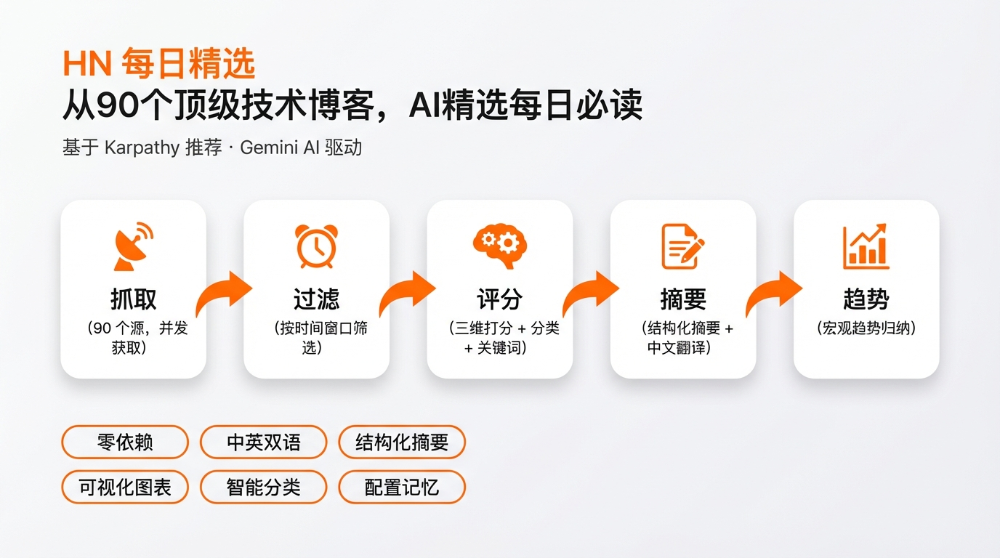

# AI Daily Digest

skill 制作详情可查看 ➡️ https://mp.weixin.qq.com/s/rkQ28KTZs5QeZqjwSCvR4Q

从 [Andrej Karpathy](https://x.com/karpathy) 推荐的 90 个 Hacker News 顶级技术博客中抓取最新文章，由 Claude Code **本地 AI** 评分筛选，生成一份结构化的每日精选日报。**零 API Key，零外部依赖。**



> 信息源来自 [Hacker News Popularity Contest 2025](https://refactoringenglish.com/tools/hn-popularity/)，涵盖 simonwillison.net、paulgraham.com、overreacted.io、gwern.net、krebsonsecurity.com 等。

## 使用方式

作为 Claude Code Skill 使用，在对话中输入 `/digest` 即可启动交互式引导流程：

```
/digest
```

Agent 会依次询问：

| 参数 | 选项 | 默认值 |
|------|------|--------|
| 时间范围 | 24h / 48h / 72h / 7天 | 48h |
| 精选数量 | 10 / 15 / 20 篇 | 15 篇 |
| 输出语言 | 中文 / English | 中文 |

配置会自动保存到 `~/.hn-daily-digest/config.json`，下次运行可一键复用。

### 直接命令行运行

脚本拆分为 **fetch** 和 **report** 两个模式：

```bash
# 1. 抓取 RSS → 输出原始文章 JSON
npx -y bun scripts/digest.ts fetch --hours 48 --output /tmp/articles.json

# 2. (中间步骤：由 Claude Code Agent 读取 JSON、评分、生成摘要、写入 scored.json)

# 3. 从已评分 JSON → 生成最终 Markdown 报告
npx -y bun scripts/digest.ts report --input /tmp/scored.json --output ./digest.md
```

## 功能

### 三步处理流水线

```
RSS 抓取 (脚本) → AI 评分+分类+摘要+翻译+趋势总结 (Claude Code) → 报告生成 (脚本)
```

1. **RSS 抓取** — 并发抓取 90 个源（10 路并发，15s 超时），兼容 RSS 2.0 和 Atom 格式，按时间窗口过滤
2. **AI 处理** — Claude Code Agent 直接完成：三维评分（相关性/质量/时效性）、六大分类、关键词提取、结构化摘要、中文翻译、趋势归纳
3. **报告生成** — 从已评分 JSON 生成完整 Markdown 日报，含可视化图表

### 日报结构

生成的 Markdown 文件包含以下板块：

| 板块 | 内容 |
|------|------|
| 📝 今日看点 | 3-5 句话的宏观趋势总结 |
| 🏆 今日必读 | Top 3 深度展示：中英双语标题、摘要、推荐理由、关键词 |
| 📊 数据概览 | 统计表格 + Mermaid 饼图（分类分布）+ Mermaid 柱状图（高频关键词）+ ASCII 纯文本图 + 话题标签云 |
| 分类文章列表 | 按 6 大分类分组，每篇含中文标题、来源、相对时间、评分、摘要、关键词 |

### 六大分类体系

| 分类 | 覆盖范围 |
|------|----------|
| 🤖 AI / ML | AI、机器学习、LLM、深度学习 |
| 🔒 安全 | 安全、隐私、漏洞、加密 |
| ⚙️ 工程 | 软件工程、架构、编程语言、系统设计 |
| 🛠 工具 / 开源 | 开发工具、开源项目、新发布的库/框架 |
| 💡 观点 / 杂谈 | 行业观点、个人思考、职业发展 |
| 📝 其他 | 不属于以上分类的内容 |

## 亮点

- **零依赖零 API Key** — 纯 TypeScript 单文件 + Claude Code 本地 AI，无第三方库，无需配置任何外部 API
- **中英双语** — 所有标题自动翻译为中文，原文标题保留为链接文字，不错过任何语境
- **结构化摘要** — 不是一句话敷衍了事，而是 4-6 句覆盖核心问题→关键论点→结论的完整概述，30 秒判断一篇文章是否值得读
- **可视化统计** — Mermaid 图表（GitHub/Obsidian 原生渲染）+ ASCII 柱状图（终端友好）+ 标签云，三种方式覆盖所有阅读场景
- **智能分类** — AI 自动将文章归入 6 大类别，按类浏览比平铺列表高效得多
- **趋势洞察** — 不只是文章列表，还会归纳当天技术圈的宏观趋势，帮你把握大方向
- **配置记忆** — 偏好参数自动持久化，日常使用一键运行

## 环境要求

- [Bun](https://bun.sh) 运行时（通过 `npx -y bun` 自动安装）
- 网络连接（访问 RSS 源）
- **无需任何 API Key**

## 信息源

90 个 RSS 源精选自 Hacker News 社区最受欢迎的独立技术博客，包括但不限于：

> Simon Willison · Paul Graham · Dan Abramov · Gwern · Krebs on Security · Antirez · John Gruber · Troy Hunt · Mitchell Hashimoto · Steve Blank · Eli Bendersky · Fabien Sanglard ...

完整列表内嵌于 `scripts/digest.ts`。
